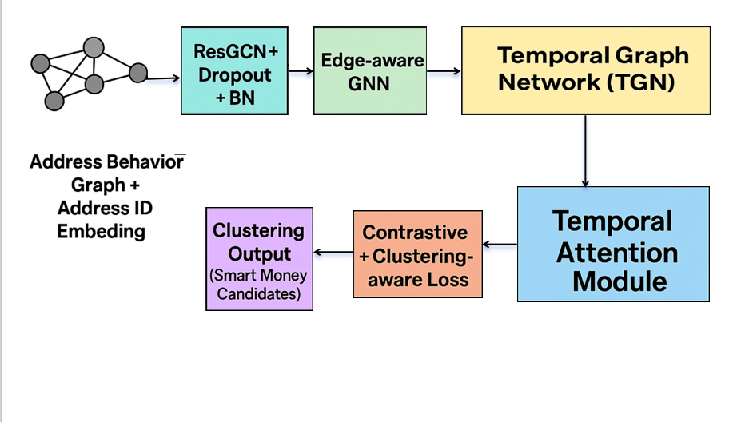

# 🧠 SmartMoney: 无监督链上聪明钱识别系统



HiFi-GNN: A Multi-dimensional Heterogeneous Graph Neural Network for Smart Money Identification

多维异构聪明钱图神经网络识别系统


本项目结合动态图神经网络与行为时间建模，自主识别潜在聪明钱地址。系统通过分析区块链上的交易行为与地址互动模式，无需标签即可发现具有策略性交易能力的"聪明钱"地址群组。支持端到端训练，具备结构建模、风格建模、自监督聚类分析能力。

## ✅ 特性
- 多层级图神经网络架构（ResGCN + Edge-aware GNN + TGN）
- Transformer/LSTM 建模行为时序演化
- 自监督学习与对比损失，无需人工标签
- 地址行为聚类与可视化解释模块
- 基于Hydra的灵活配置管理

## 🚀 快速启动

### 环境安装
```bash
# 安装主要依赖
pip install -r requirements.txt

# 特殊依赖安装（Windows）
# 项目包含预编译wheels，用于简化安装
pip install ./wheels/torch_cluster-1.6.3+pt25cu118-cp311-cp311-win_amd64.whl
pip install ./wheels/torch_scatter-2.1.2+pt25cu118-cp311-cp311-win_amd64.whl
pip install ./wheels/torch_sparse-0.6.18+pt25cu118-cp311-cp311-win_amd64.whl
pip install ./wheels/torch_spline_conv-1.2.2+pt25cu118-cp311-cp311-win_amd64.whl
```

### 数据准备
```bash
# 生成测试数据（仅用于模型验证）
python generate_test_data.py

# 构建地址行为图
python utils/graph_utils.py
```

### 模型训练
```bash
# 主训练流程
python train/train.py

# 或使用特定配置
python train/train.py model=large train=stage2
```

### 推理与分析
```bash
# 生成地址embedding并进行聚类
python inference/inference.py

# 评估聚类效果和可视化
python evaluation/evaluate.py
```

## 📊 可视化分析
- Attention Heatmap（行为重点）
- 聚类分布图（UMAP/tSNE）
- 智能合约偏好频率图
- 交易行为时序分析

## 📋 项目结构
```
SmartAI/AI/
├── data/                  # 存放 .pt 格式的地址行为图
├── models/                # 模型定义
│   ├── edge_gnn.py        # 边特征感知GNN实现
│   ├── resgcn.py          # 残差图神经网络
│   ├── tgn_module.py      # 时间图网络模块
│   ├── temporal_attention.py # 时间序列注意力模块
│   ├── smartmoney_model.py # 聪明钱识别主模型
│   └── contrastive_loss.py # 对比学习和聚类损失函数
├── train/                 # 训练模块
│   ├── train.py           # 训练入口脚本
│   └── trainer.py         # 训练管理器
├── inference/             # 推理模块
│   └── inference.py       # 模型推理和聚类分析
├── evaluation/            # 评估与可视化模块
│   ├── evaluate.py        # 评估入口
│   └── metrics.py         # 评估指标实现
├── utils/                 # 工具函数
│   ├── dataset.py         # 数据集加载与预处理
│   ├── graph_utils.py     # 图构建与处理工具
│   └── train_utils.py     # 训练辅助工具
├── configs/               # Hydra配置
│   ├── config.yaml        # 主配置文件
│   ├── model/             # 模型相关配置
│   └── train/             # 训练配置
├── checkpoints/           # 模型检查点存储
├── requirements.txt       # 项目依赖
└── README.md
```

## 📝 配置管理
本项目使用 Hydra 进行配置管理，主要配置文件位于 `configs/` 目录下：
- `config.yaml`：基础配置（数据、训练参数等）
- `model/*.yaml`：模型相关配置（结构、隐藏层维度等）
- `train/*.yaml`：训练相关配置（学习率、优化器等）

配置示例：
```yaml
# 使用不同的模型配置
python train/train.py model=large

# 使用不同的训练阶段配置
python train/train.py train=stage2

# 覆盖单个参数
python train/train.py train.lr=0.0001
```

## 🧪 技术详情
- **多层级图神经网络**：
  - **ResGCN**：捕捉地址间深层图结构关系
  - **Edge-aware GNN**：利用交易语义特征，理解交易行为模式
  - **TGN**：建模时序动态行为，追踪地址行为演化
  
- **时序行为建模**：
  - **Transformer/LSTM**：捕捉长期投资风格与决策模式
  - **时间编码**：整合时间信息，识别投资周期性
  
- **自监督学习**：
  - **对比学习**：相似行为地址表示接近，不同行为表示分离
  - **聚类辅助任务**：无需标签即可区分不同投资风格
  
- **多阶段训练**：
  - **第一阶段**：结构特征学习
  - **第二阶段**：时序模式学习
  - **第三阶段**：端到端整体优化

## 📈 应用场景
- **投资行为分析**：识别并研究成功策略模式
- **风险监控**：发现异常或潜在风险地址
- **市场分析**：识别不同投资风格群体的行为模式
- **科研探索**：链上行为模式分析与用户画像研究