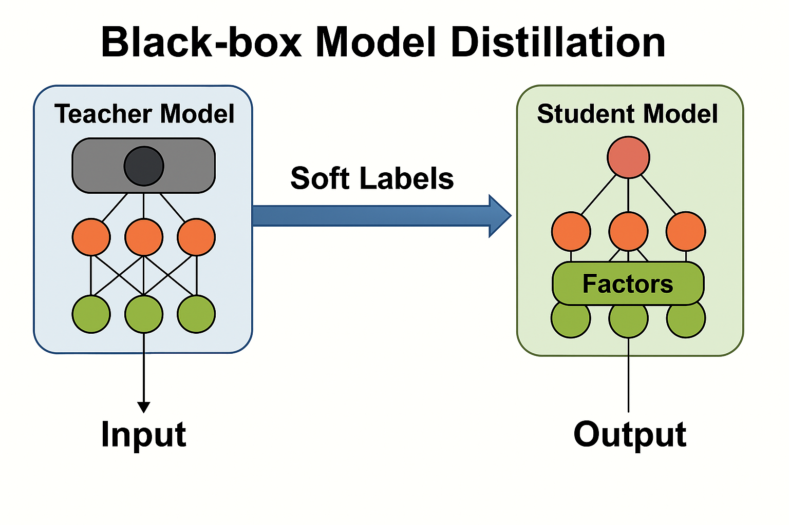

# 知识蒸馏与模型压缩框架



这个项目提供了一个灵活的知识蒸馏框架，用于执行模型压缩和知识迁移。通过将复杂模型（教师）的知识转移到简单模型（学生）中，可以实现模型轻量化和性能优化。

## 特性

- 支持多种教师模型：
  - 经典机器学习模型 (XGBoost, LightGBM, Random Forest, CatBoost)
  - 深度学习模型 (PyTorch CNN, PyTorch MLP)
  
- 支持多种学生模型：
  - 轻量级机器学习模型 (Logistic Regression, SVM, Decision Tree, sklearn MLP)
  - 深度学习模型 (PyTorch CNN, PyTorch MLP)

- 灵活的知识蒸馏实现：
  - 基于软标签的知识迁移
  - 温度缩放和权重调整
  - 适应不同的模型类型和框架
  
- 自主因子选择功能：
  - 学生模型自动选择最重要的特征
  - 自适应控制特征选择数量
  - 适用于所有PyTorch学生模型

## 安装

```bash
pip install -r requirements.txt
```

## 使用示例

### 使用PyTorch模型进行知识蒸馏

```python
from src.core.models.teacher import TeacherModel
from src.core.models.student import StudentModel
from sklearn.datasets import load_digits
from sklearn.model_selection import train_test_split
from sklearn.preprocessing import StandardScaler

# 1. 准备数据
X, y = load_digits(return_X_y=True)
X_train, X_test, y_train, y_test = train_test_split(X, y, test_size=0.2, random_state=42)

# 数据标准化
scaler = StandardScaler()
X_train = scaler.fit_transform(X_train)
X_test = scaler.transform(X_test)

# 2. 配置和训练教师模型 (PyTorch CNN)
teacher_params = {
    'n_classes': 10,
    'input_channels': 1,
    'img_size': 8,  # 数字图像为8x8
    'learning_rate': 0.001,
    'batch_size': 64,
    'epochs': 20
}

teacher = TeacherModel(
    model_type='teacher', 
    model_name='pytorch_cnn', 
    model_params=teacher_params
)

teacher.train(X_train, y_train)

# 3. 使用教师模型生成软标签
soft_labels = teacher.predict_proba(X_train)

# 4. 配置和训练学生模型 (PyTorch MLP 或者其他轻量级模型)
student_params = {
    'n_classes': 10,
    'input_size': X_train.shape[1],
    'hidden_sizes': [64, 32],
    'learning_rate': 0.001,
    'batch_size': 64,
    'epochs': 20,
    'temperature': 2.0,  # 温度参数
    'enable_factor_selection': True,  # 启用因子选择功能
    'max_factor_ratio': 0.2,         # 最多使用20%的特征
    'factor_temperature': 1.0        # 特征选择温度参数
}

student = StudentModel(
    model_type='student',
    model_name='pytorch_mlp',
    model_params=student_params
)

# 使用软标签训练学生模型
student.train(
    X_train, y_train, 
    teacher_probs=soft_labels, 
    alpha=0.7,  # 软标签权重
    temperature=2.0,
    l1_lambda=0.001  # 特征选择正则化强度
)

# 5. 评估蒸馏效果
teacher_acc = (teacher.predict(X_test) == y_test).mean()
student_acc = (student.predict(X_test) == y_test).mean()

print(f"教师模型准确率: {teacher_acc:.4f}")
print(f"学生模型准确率: {student_acc:.4f}")

# 6. 查看学生模型选择的特征
selected_features = student.get_selected_features()
print(f"学生模型选择了 {len(selected_features)} 个特征: {selected_features}")
```

### 使用因子选择CNN模型

```python
# 使用带自主因子选择的CNN学生模型
student_params = {
    'n_classes': 10,
    'input_channels': 1,
    'img_size': 8,
    'learning_rate': 0.001,
    'batch_size': 64,
    'epochs': 20,
    'enable_factor_selection': True,  # 启用特征选择
    'max_factor_ratio': 0.3,          # 最多使用30%的特征
    'factor_temperature': 1.5         # 特征选择温度参数
}

student = StudentModel(
    model_type='student',
    model_name='pytorch_cnn', 
    model_params=student_params
)

# 训练带特征选择的CNN学生模型
student.train(
    X_train, y_train, 
    teacher_probs=soft_labels, 
    alpha=0.7,
    temperature=2.0,
    l1_lambda=0.005  # 特征稀疏性控制
)
```

## 自主因子选择功能

此框架支持学生模型的自主因子选择功能，使模型能够自动挑选最重要的特征，提高效率和性能。详情请参阅[自主因子选择文档](docs/factor_selection.md)。

## 扩展支持的模型

项目支持通过模型注册表添加新的模型类型：

```python
from src.core.models.model_registry import ModelRegistry

# 注册新的教师或学生模型
ModelRegistry.register_teacher_model("my_new_model", "module.path.to.MyModelClass")
ModelRegistry.register_student_model("my_new_model", "module.path.to.MyModelClass")
``` 